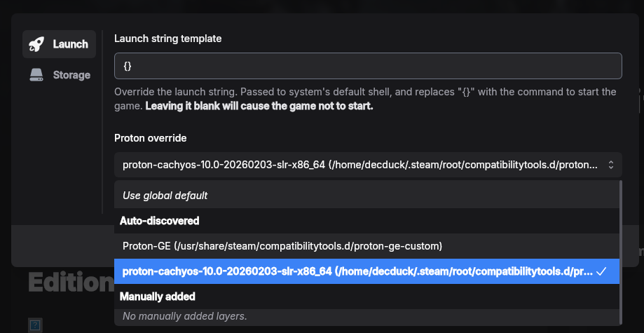

Drop's Proton configuration depends on:

- UMU launcher (more specifically the `umu-run` binary)
- **another application** to download and manage Proton versions

## Installing UMU launcher

Install UMU launcher through their own guide on [their GitHub repo](https://github.com/Open-Wine-Components/umu-launcher?tab=readme-ov-file#packaging). It covers packaging for a variety of distro. If you're not covered, give it a Google search, or open an issue on GitHub or Discord and we'll try to help you.

To check it's installed, try running `umu-run` from your terminal.

:::note
If you're using Distrobox, it needs to be installed within the container.
:::

## Downloading other Proton versions

You can download other Proton versions from a variety of sources:

- Directly from the project, typically in a GitHub release
- Through Steam, which downloads official Proton versions
- 3rd-party application

For the 3rd-party application, we recommend [ProtonUp-Qt](https://github.com/DavidoTek/ProtonUp-Qt), an open-source GUI application that supports quite a few different versions of Proton.

## Detecting Proton versions

Drop searches the following places for Proton versions:

- `/usr/share/steam/compatibilitytools.d/`
- `~/.steam/root/compatibilitytools.d/`

Most applications support reading and writing to these directories for Proton versions, as they're Steam directories.

Drop can also pick up other Proton versions, if you manually add them.

:::note
To be discovered by Drop, the folder you provide, or any folder in one of the above directories **must**:

- have the `proton` binary
- have a `compatibilitytool.vdf` file

:::

## Using Proton versions

:::caution
To launch any Windows game, you **must** first set a default Proton version.
:::

Drop uses a global default Proton version to launch games by default. You can override this in a game's options. 

